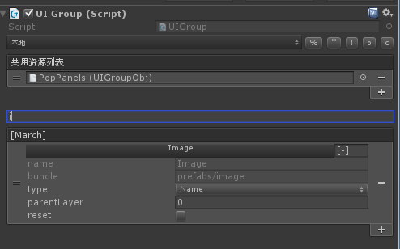
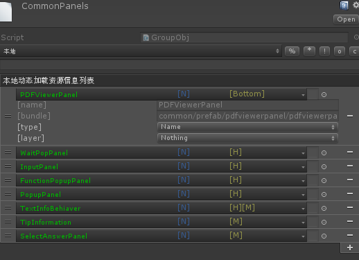

# BundleUISystem
## What?
  it just a very little framwork of ugui open and close,but you can also used as world object create and destory.but one question you must
  know is object can only create once,before it destory
## GraphWork
  there are tow options to store information of you object
  ### 1.in Scene view 
  
  ### 2.ScriptObject
  
  ### 3.No AssetBundleLoader
  
## About
  it work for my projects,so it will continuily update
  ### Rotorz is required
  [!Reorderable List Editor Field for Unity](https://bitbucket.org/rotorz/reorderable-list-editor-field-for-unity)
  ### AssetBundleTools is required (and define in projectSetting)
  [!AssetBundleTools](https://github.com/zouhunter/AssetBundleTools/tree/master/AssetBundleTool)

